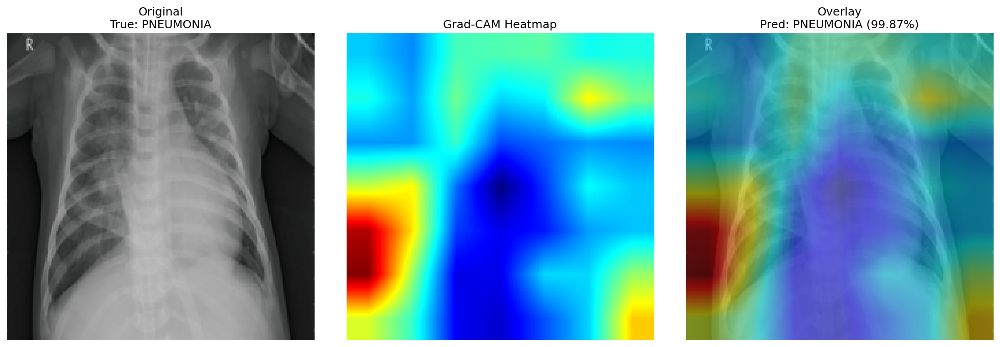
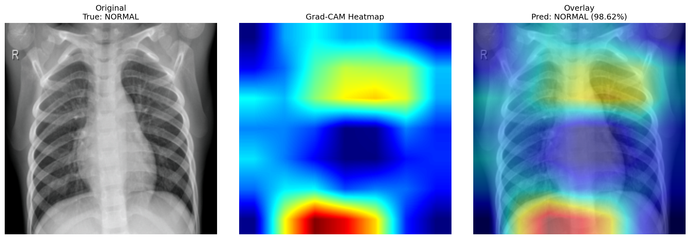

# Medical Image Diagnosis Assistant

AI-powered chest X-ray analysis using CNN, Grad-CAM explainability, and LLM-generated diagnostic reports.

## Demo

## Tech Stack
- PyTorch + ResNet50 (fine-tuned)
- Grad-CAM explainability
- LangChain + FAISS (RAG pipeline)
- Groq/Llama3 LLM
- FastAPI + React
- MLflow + Docker

## Results
- Validation Accuracy: 85.9%
- AUC-ROC: 0.94
- Pneumonia Recall: 0.99 (catches 99% of sick patients)

## Project Structure
\\\
medical-diagnosis-assistant/
+-- notebooks/
¦   +-- day2_pytorch_basics.ipynb
¦   +-- day3_model.ipynb
¦   +-- week2_rag.ipynb
¦   +-- gradcam_result.png
¦   +-- gradcam_normal.png
+-- models/          # saved model weights (not tracked)
+-- data/            # chest xray dataset (not tracked)
+-- README.md
\\\

## Status
- [x] Week 1: CNN theory + PyTorch fundamentals
- [x] Week 1: ResNet50 fine-tuning + evaluation (85.9% accuracy)
- [x] Week 2: Grad-CAM explainability heatmaps
- [x] Week 2: RAG pipeline with FAISS + Groq LLM
- [ ] Week 3: FastAPI + React frontend
- [ ] Week 4: MLflow + Docker + Deploy
